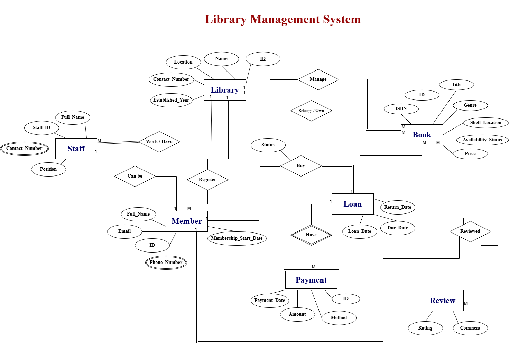

# **Library Management System DB**

## Description of database: 

 **The Library Management System** is designed to manage books, members, staff, 
loans, and transactions efficiently. The system includes libraries where each library 
has a unique ID, name, location, contact number, and established year. Each library 
must manage books, where each book is identified by a unique ID, ISBN, title, genre, 
price, availability status, and shelf location. A book belongs to exactly one library, 
and a library may own many books. 
Members can register with personal information such as ID, full name, email, phone 
number, and membership start date. A member can borrow zero or more books. 
Each loan links one member with one book and includes loan date, due date, return 
date, and status. 
Each loan may have zero or more fine payments, where a payment is uniquely 
identified and includes payment date, amount, and method. Payment always 
corresponds to one specific loan. 
Staff work at a specific library, identified by staff ID, full name, position, and contact 
number. Each library must have at least one staff member, but each member of staff 
works at only one library. 
Members may also review books, where a review includes a rating, comments, and 
review date. Each review is linked to a specific book and a specific member. A 
member can provide multiple reviews, and a book may receive many reviews. 

## Draw the ERD Diagram:
  
   1. Include entities, attributes, keys, relationships, cardinality, and participation. 
   2. Use clear notation and include weak entities and M: N relationships. 

**1. libraries:**
- Attributes:
  - ID (Primary Key)
  - Name
  - Location
  - Contact_Number (Multi-valued)
  - Established_Year
    
**2. Book:**
- Attributes:
   - ID (Primary Key)
   - ISBN
   - Title
   - Genre
   - Price
   - Availability_S_tatus
   - Shelf_L_ocation

**3. Member:**
- Attributes:
   - ID (Primary Key)
   - Full_Name
   - Email
   - Phone_Number
   - Membership_Start_Date

**4. Loan:**
- Attributes:
  - Loan_Date
  - Due_Date
  - Return_Date

**5. Payment:**
- Attributes:
  - ID (Primary Key)
  - Payment_Date
  - Amount
  - Method

**6. Staff:**
- Attributes:
  - Staff_ID (Primary Key)
  - Full_Name
  - Position
  - Contact_Number

**7. Review:**
- Attributes:
  - Rating
  - Comments

]