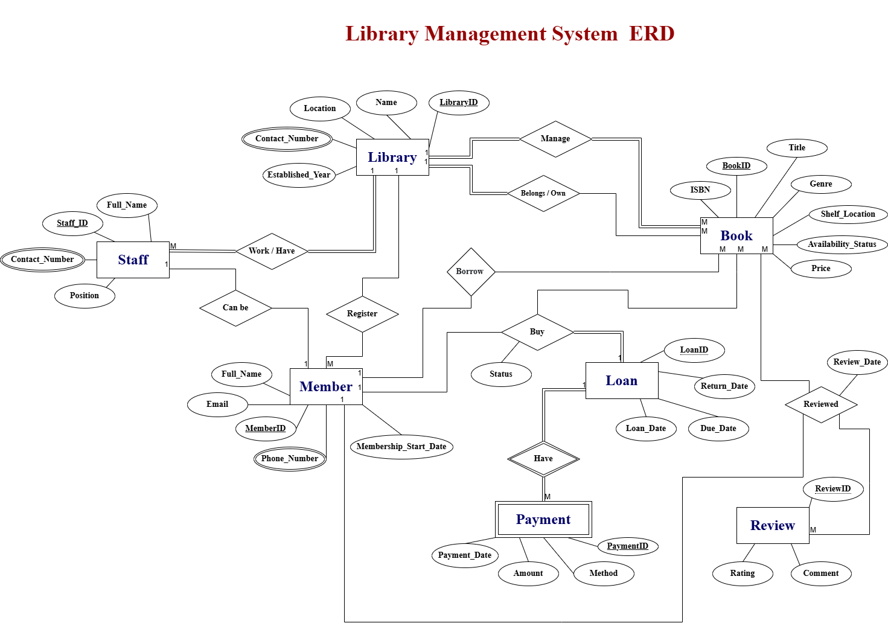
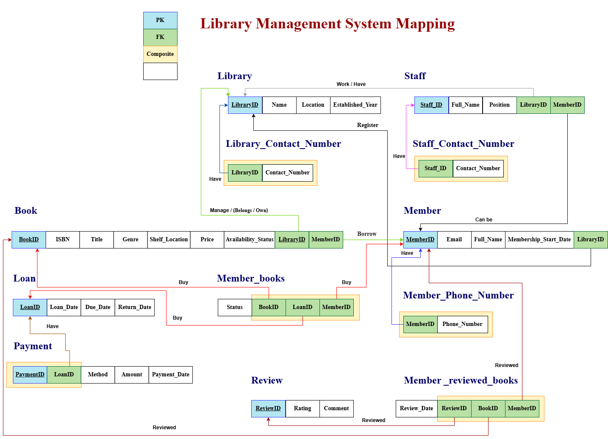
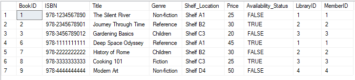
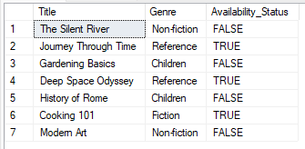
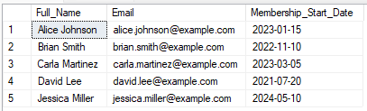
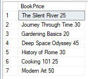
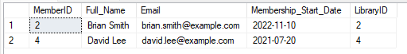
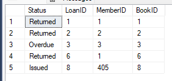
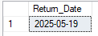

# **Library Management System DB**

## Description of database: 

 **The Library Management System** is designed to manage books, members, staff, 
loans, and transactions efficiently. The system includes libraries where each library 
has a unique ID, name, location, contact number, and established year. Each library 
must manage books, where each book is identified by a unique ID, ISBN, title, genre, 
price, availability status, and shelf location. A book belongs to exactly one library, 
and a library may own many books. 
Members can register with personal information such as ID, full name, email, phone 
number, and membership start date. A member can borrow zero or more books. 
Each loan links one member with one book and includes loan date, due date, return 
date, and status. 
Each loan may have zero or more fine payments, where a payment is uniquely 
identified and includes payment date, amount, and method. Payment always 
corresponds to one specific loan. 
Staff work at a specific library, identified by staff ID, full name, position, and contact 
number. Each library must have at least one staff member, but each member of staff 
works at only one library. 
Members may also review books, where a review includes a rating, comments, and 
review date. Each review is linked to a specific book and a specific member. A 
member can provide multiple reviews, and a book may receive many reviews. 

## **Day 1: System Analysis & Database Design**
### Draw the ERD Diagram:
  
   1. Include entities, attributes, keys, relationships, cardinality, and participation. 
   2. Use clear notation and include weak entities and M: N relationships. 

**1. libraries:**
- Attributes:
  - ID (Primary Key)
  - Name
  - Location
  - Contact_Number (Multi-valued)
  - Established_Year
    
**2. Book:**
- Attributes:
   - ID (Primary Key)
   - ISBN
   - Title
   - Genre
   - Price
   - Availability_S_tatus
   - Shelf_L_ocation

**3. Member:**
- Attributes:
   - ID (Primary Key)
   - Full_Name
   - Email
   - Phone_Number
   - Membership_Start_Date

**4. Loan:**
- Attributes:
  - Loan_Date
  - Due_Date
  - Return_Date

**5. Payment:**
- Attributes:
  - ID (Primary Key)
  - Payment_Date
  - Amount
  - Method

**6. Staff:**
- Attributes:
  - Staff_ID (Primary Key)
  - Full_Name
  - Position
  - Contact_Number

**7. Review:**
- Attributes:
  - Rating
  - Comments



### Map the ERD to Relational Schema:
- Convert the ERD into relational tables with PKs and FKs defined. 



### Normalization Practice 
- Choose 2–3 tables to normalize. 
- Show step-by-step conversion to 1NF → 2NF → 3NF. 
- Justify each normalization step. 

**1. Book table:**
|BookID |ISBN |Title |Genre |Shelf_Location |Price |Availability_Status |LibraryID |MemberID |
|-------|-----|------|------|---------------|------|--------------------|----------|---------|

- First Normal Form (1NF) 
  This step will not be executed because there are no duplicates in the columns.

- Second Normal Form (2NF) and Third Normal Form (3NF) 

|BookID |ISBN |Title |Genre |Shelf_Location |Price |Availability_Status |
|-------|-----|------|------|---------------|------|--------------------|

|BookID |LibraryID |MemberID |
|-------|----------|---------|

In these two steps we need to make sure that all non-key attributes must depend on the whole primary key 
and non-key attributes should depend only on the key, not other non-key attributes

**2. Member:**
|MemberID |Email |Full_Name |Membership_Start_Date |LibraryID |
|---------|------|----------|----------------------|----------|

- First Normal Form (1NF) 
  This step will not be executed because there are no duplicates in the columns.

- Second Normal Form (2NF) and Third Normal Form (3NF) 

|MemberID |Email |Full_Name |Membership_Start_Date |
|---------|------|----------|----------------------|

|MemberID |LibraryID |
|---------|----------|

## **Day 2: Database Implementation & Realistic Data**

### 1. Use DDL commands to create the physical schema:

```sql
--to create the database with name LibraryManagementSystem
CREATE DATABASE LibraryManagementSystem;
--to use the database
USE LibraryManagementSystem;
----------------------------------------------------DDL (CREATION OF THE TABLE)-------------------------------------------------------------------------
--to create Library table
CREATE TABLE Library (
    LibraryID int PRIMARY KEY identity(1,1) NOT NULL, 
    LibraryName varchar(255) NOT NULL,
	LibraryLocation varchar(255) NOT NULL,
	Established_Year int NOT NULL CHECK(Established_Year > 1990)
);
--to create Library_Contact_Number table
CREATE TABLE Library_Contact_Number (
	Contact_Number int NOT NULL CONSTRAINT CK_Only8Digits CHECK(LEN(RTRIM(Contact_Number)) = 8),
	LibraryID int, foreign key(LibraryID) references Library(LibraryID)  
	ON DELETE CASCADE 
    ON UPDATE CASCADE,
	 PRIMARY KEY(LibraryID, Contact_Number)
);

--NOTE:
--CHECK(LEN(RTRIM(Contact_Number)) = 8) --> to make sure that Contact_Number length is not > 8
--	ON DELETE CASCADE / ON UPDATE CASCADE --> if any change happen to PK all the FK link to it will be changed

--to create Member table
CREATE TABLE Member (
    MemberID int PRIMARY KEY identity(1,1) NOT NULL, 
    Full_Name varchar(255) NOT NULL,
    Email varchar(255) NOT NULL,
	Membership_Start_Date Date NOT NULL,
	LibraryID int, foreign key(LibraryID) references Library(LibraryID)  
	ON DELETE CASCADE 
    ON UPDATE CASCADE
);
--to create Member_Phone_Number table
CREATE TABLE Member_Phone_Number (
	Phone_Number int NOT NULL CONSTRAINT CK_Only8Digits_Member CHECK(LEN(RTRIM(Phone_Number)) = 8),
	MemberID int, foreign key(MemberID) references Member(MemberID)  
	ON DELETE CASCADE 
    ON UPDATE CASCADE,
	PRIMARY KEY(MemberID, Phone_Number)
);

--to create Staff table
CREATE TABLE Staff (
    Staff_ID int PRIMARY KEY identity(1,1) NOT NULL, 
    Full_Name varchar(255) NOT NULL,
    Position varchar(255) NOT NULL,
	LibraryID int, foreign key(LibraryID) references Library(LibraryID)  
	ON DELETE CASCADE 
    ON UPDATE CASCADE,
	MemberID int, foreign key(MemberID) references Member(MemberID)  
	ON DELETE NO ACTION
    ON UPDATE NO ACTION
);
--to create Staff_Contact_Number table
CREATE TABLE Staff_Contact_Number (
	Contact_Number int NOT NULL CONSTRAINT CK_Only8Digits_Staff CHECK(LEN(RTRIM(Contact_Number)) = 8),
	Staff_ID int, foreign key(Staff_ID) references Staff(Staff_ID)  
	ON DELETE CASCADE 
    ON UPDATE CASCADE,
	PRIMARY KEY(Staff_ID, Contact_Number)
);

--to create Book table
CREATE TABLE Book (
    BookID int PRIMARY KEY identity(1,1) NOT NULL, 
    ISBN varchar(255) NOT NULL UNIQUE,
    Title varchar(255) NOT NULL,
	Genre varchar(255) NOT NULL,
	Shelf_Location varchar(255) NOT NULL,
	Price int NOT NULL CONSTRAINT CK_GraterThanZero CHECK(Price > 0),
	Availability_Status varchar(255) NOT NULL DEFAULT 'TRUE',
	LibraryID int, foreign key(LibraryID) references Library(LibraryID)  
	ON DELETE CASCADE 
    ON UPDATE CASCADE,
	MemberID int, foreign key(MemberID) references Member(MemberID)  
	ON DELETE NO ACTION
    ON UPDATE NO ACTION
);

--to create Loan table
CREATE TABLE Loan (
    LoanID int PRIMARY KEY identity(1,1) NOT NULL, 
    Loan_Date Date NOT NULL,
	Due_Date Date NOT NULL,
	Return_Date Date NOT NULL
);
--to create Payment table
CREATE TABLE Payment (
    PaymentID int PRIMARY KEY identity(1,1) NOT NULL, 
    Method varchar(255) NOT NULL,
	Amount int NOT NULL CONSTRAINT CK_GraterThanZero_Amount CHECK(Amount > 0),
	Payment_Date Date NOT NULL,
	LoanID int, foreign key(LoanID) references Loan(LoanID)  
	ON DELETE CASCADE 
    ON UPDATE CASCADE
);

--to create Member_books table
CREATE TABLE Member_books (
    Status varchar(255) NOT NULL DEFAULT 'Issued',
	LoanID int, foreign key(LoanID) references Loan(LoanID)  
	ON DELETE CASCADE 
    ON UPDATE CASCADE,
	MemberID int, foreign key(MemberID) references Member(MemberID)  
	ON DELETE NO ACTION
    ON UPDATE NO ACTION,
	BookID int, foreign key(BookID) references Book(BookID)  
	ON DELETE NO ACTION
    ON UPDATE NO ACTION,
	PRIMARY KEY(LoanID, MemberID, BookID)
);

--to create Review table
CREATE TABLE Review (
    ReviewID int PRIMARY KEY identity(1,1) NOT NULL, 
    Rating int NOT NULL CONSTRAINT Ch_Rating_From_One_To_Five CHECK (Rating > 0 and Rating < 6),
	Comment varchar(255) NOT NULL DEFAULT 'No comments'
);

--to create Member_reviewed_books table
CREATE TABLE Member_reviewed_books (
    Review_Date Date NOT NULL,
	ReviewID int, foreign key(ReviewID) references Review(ReviewID)  
	ON DELETE CASCADE 
    ON UPDATE CASCADE,
	MemberID int, foreign key(MemberID) references Member(MemberID)  
	ON DELETE NO ACTION
    ON UPDATE NO ACTION,
	BookID int, foreign key(BookID) references Book(BookID)  
	ON DELETE NO ACTION
    ON UPDATE NO ACTION,
	PRIMARY KEY(ReviewID, MemberID, BookID)
);
```

~~NOTE:~~

Adding CONSTRAINT to Genre column in Book table
```sql
--1. update all the row in Book table to follow the constraint of Genre column 
UPDATE Book
SET Genre = 
    CASE (BookID % 4)
        WHEN 0 THEN 'Fiction'
        WHEN 1 THEN 'Non-fiction'
        WHEN 2 THEN 'Reference'
        WHEN 3 THEN 'Children'
    END;

--2. add constraint of Genre column
ALTER TABLE Book 
ADD CONSTRAINT Ch_Value_Is CHECK (Genre IN ( 'Fiction', 'Non-fiction', 'Reference', 'Children' ));
```

### 2. Insert real-world data, Minimum required data: 
- (2–3) Libraries 
- (10+) Books 
- (6+) Members 
- (8–10) Loans 
- (4+) Payments 
- (4+) Staff 
- (6+) Reviews 

```sql
------------------------------------------------------------------DML (INSERATION DATA TO THE TABLES)---------------------------------------------------
--to insert date to Library table
INSERT INTO Library (LibraryName, LibraryLocation, Established_Year)
VALUES
('Central City Library', 'Downtown, Central City', 1995),
('Riverside Public Library', 'Riverside Blvd, Eastside', 2001),
('Greenwood Community Library', 'Greenwood Ave, Westside', 1998),
('Northview Library', 'Northview Rd, Uptown', 2005),
('Lakeside Knowledge Center', 'Lakeside Park, Southside', 2010);

SELECT * FROM Library;

--to insert date to Library_Contact_Number table
INSERT INTO Library_Contact_Number (Contact_Number, LibraryID)
VALUES
(12345678, 1),
(23456789, 2),
(34567890, 3),
(45678901, 4),
(56789012, 5);

SELECT * FROM Library_Contact_Number;

--to insert date to Member table
INSERT INTO Member (Full_Name, Email, Membership_Start_Date, LibraryID)
VALUES
('Alice Johnson', 'alice.johnson@example.com', '2023-01-15', 1),
('Brian Smith', 'brian.smith@example.com', '2022-11-10', 2),
('Carla Martinez', 'carla.martinez@example.com', '2023-03-05', 3),
('David Lee', 'david.lee@example.com', '2021-07-20', 4),
('Emma Brown', 'emma.brown@example.com', '2024-02-28', 5);

INSERT INTO Member (Full_Name, Email, Membership_Start_Date, LibraryID)
VALUES
('Jessica Miller', 'jessica.miller@example.com', '2024-05-10', 3);

SELECT * FROM Member;

--to insert date to Member_Phone_Number table
INSERT INTO Member_Phone_Number (Phone_Number, MemberID)
VALUES
(81234567, 1),
(82345678, 2),
(83456789, 3),
(84567890, 4),
(85678901, 5);

SELECT * FROM Member_Phone_Number;

--to insert date to Staff table
INSERT INTO Staff (Full_Name, Position, LibraryID, MemberID)
VALUES
('Laura Green', 'Librarian', 1, 1),
('Thomas Gray', 'Assistant Librarian', 2, 2),
('Nina Patel', 'Archivist', 3, 3),
('George Kim', 'Library Technician', 4, 4),
('Sophia Turner', 'Customer Service Rep', 5, 5);

SELECT * FROM Staff;

--to insert date to Staff_Contact_Number table
INSERT INTO Staff_Contact_Number (Contact_Number, Staff_ID)
VALUES
(87654321, 1),
(86543210, 2),
(85432109, 3),
(84321098, 4),
(83210987, 5);

SELECT * FROM Staff_Contact_Number;

--to insert date to Book table
INSERT INTO Book (ISBN, Title, Genre, Shelf_Location, Price, Availability_Status, LibraryID, MemberID)
VALUES
('978-1234567890', 'The Silent River', 'Mystery', 'Shelf A1', 25, 'FALSE', 1, 1),
('978-2345678901', 'Journey Through Time', 'Science Fiction', 'Shelf B2', 30, 'TRUE', 2, 2),
('978-3456789012', 'Gardening Basics', 'Non-Fiction', 'Shelf C3', 20, 'FALSE', 3, 3),
('978-4567890123', 'The Art of Cooking', 'Cooking', 'Shelf D4', 28, 'TRUE', 4, 4),
('978-5678901234', 'Legends of the East', 'Fantasy', 'Shelf E5', 35, 'FALSE', 5, 5);

INSERT INTO Book (ISBN, Title, Genre, Shelf_Location, Price, Availability_Status, LibraryID, MemberID)
VALUES
('978-1111111111', 'Deep Space Odyssey', 'Science Fiction', 'Shelf A1', 45, 'TRUE', 1, 1),
('978-2222222222', 'History of Rome', 'History', 'Shelf B2', 30, 'FALSE', 2, 2),
('978-3333333333', 'Cooking 101', 'Cooking', 'Shelf C3', 25, 'TRUE', 3, 3),
('978-4444444444', 'Modern Art', 'Art', 'Shelf D4', 50, 'FALSE', 4, 4),
('978-5555555555', 'Wildlife Photography', 'Photography', 'Shelf E5', 40, 'TRUE', 5, 5);

SELECT * FROM Book;

--to insert date to Loan table
INSERT INTO Loan (Loan_Date, Due_Date, Return_Date)
VALUES
('2024-12-01', '2024-12-15', '2024-12-14'),
('2025-01-10', '2025-01-24', '2025-01-20'),
('2025-02-05', '2025-02-19', '2025-02-18'),
('2025-03-01', '2025-03-15', '2025-03-16'),
('2025-04-12', '2025-04-26', '2025-04-25');

INSERT INTO Loan (Loan_Date, Due_Date, Return_Date)
VALUES
('2025-01-01', '2025-01-15', '2025-01-14'),
('2025-02-10', '2025-02-24', '2025-02-22'),
('2025-03-05', '2025-03-19', '2025-03-18'),
('2025-04-12', '2025-04-26', '2025-04-28'),
('2025-05-01', '2025-05-15', '2025-05-14');

SELECT * FROM Loan;

--to insert date to Payment table
INSERT INTO Payment (Method, Amount, Payment_Date, LoanID)
VALUES
('Credit Card', 50, '2024-12-16', 1),
('Cash', 30, '2025-01-21', 2),
('Debit Card', 40, '2025-02-19', 3),
('Credit Card', 60, '2025-03-17', 4),
('Online Transfer', 25, '2025-04-26', 5);

SELECT * FROM Payment;

--to insert date to Member_books table
INSERT INTO Member_books (Status, LoanID, MemberID, BookID) VALUES
('Issued', 1, 1, 1),
('Returned', 2, 2, 2),
('Overdue', 3, 3, 3),
('Issued', 4, 4, 4),
('Returned', 5, 5, 5);

SELECT * FROM Member_books;

--to insert date to Review table
INSERT INTO Review (Rating, Comment) VALUES
(5, 'Excellent book! Highly recommend.'),
(4, 'Good read, but a bit slow in the middle.'),
(3, 'Average, nothing special.'),
(2, 'Did not enjoy it much.'),
(1, 'Poor writing and confusing plot.');

INSERT INTO Review (Rating, Comment) VALUES
(4, 'Great book, enjoyed the storyline!');

SELECT * FROM Review;

--to insert date to Member_reviewed_books table
INSERT INTO Member_reviewed_books (Review_Date, ReviewID, MemberID, BookID) VALUES
('2025-05-01', 1, 1, 1),
('2025-05-02', 2, 2, 2),
('2025-05-03', 3, 3, 3),
('2025-05-04', 4, 4, 4),
('2025-05-05', 5, 5, 5);

SELECT * FROM Member_reviewed_books;
```

### 3. Use DML to simulate real application behavior: 
- Mark books as returned 
- Update loan status 
- Delete reviews/payments 

```sql
-- Mark books as returned  
INSERT INTO Member_books (Status, LoanID, MemberID, BookID) VALUES
('Returned', 6, 1, 6);

--Update loan status 
UPDATE Member_books 
SET Status = 'Returned'
WHERE LoanID = 1 AND  
      MemberID = 1 AND 
	  BookID = 1;

--Delete reviews/payments 

-- Review
DELETE FROM Review 
WHERE ReviewID = 1;

-- payments
DELETE FROM Payment 
WHERE PaymentID = 1;
```

### 4. Try deleting a member who: 
- Has existing loans 
- Has written book reviews 

```sql
DELETE FROM Staff 
WHERE MemberID = 5; 

DELETE FROM Member_books 
WHERE MemberID = 5; 

DELETE FROM Member_reviewed_books 
WHERE MemberID = 5; 

DELETE FROM Book
WHERE MemberID = 5;  

DELETE FROM Member 
WHERE MemberID = 5;
```
### 5. Try deleting a book that: 
- Is currently on loan 
- Has multiple reviews attached to it 

```sql
DELETE FROM Member_reviewed_books 
WHERE BookID = 4; 

DELETE FROM Member_books 
WHERE BookID = 4; 

DELETE FROM Book
WHERE BookID = 4; 
```

### 6. Try inserting a loan for: 
- A member who doesn’t exist 
- A book that doesn’t exist 

```sql
INSERT INTO Member_books (Status, LoanID, MemberID, BookID) VALUES
('Issued', 1, 30, 30);
```
### 7. Try updating a book’s genre to: 
- A value not included in your allowed genre list (e.g., 'Sci-Fi') 
```sql
UPDATE Book 
SET Genre = 'Sci-Fi'
WHERE BookID = 1;
```

### 8. Try inserting a payment with: 
- A zero or negative amount 
- A missing payment method 
```sql
INSERT INTO Payment (Method, Amount, Payment_Date, LoanID)
VALUES
( 0, '2025-04-26', 5);
```

### 9. Try inserting a review for: 
- A book that does not exist 
- A member who was never registered 
```sql
INSERT INTO Member_reviewed_books (Review_Date, ReviewID, MemberID, BookID) VALUES
('2025-05-05', 5, 49, 33);
```

## **Task 7: Library Database – DQL & DML Tasks** 
### 1. Display all book records. 
```sql
SELECT * FROM Book;
```


### 2. Show each book’s title, genre, and availability. 
```sql
SELECT Title, Genre, Availability_Status FROM Book;
```


### 3. Display all members' names, email, and membership start date. 
```sql
SELECT Full_Name, Email, Membership_Start_Date FROM Member;
```


### 4. Display each book’s title and price with alias “BookPrice”. 
```sql
SELECT CONCAT (Title , ' ' , Price) as 'BookPrice' FROM Book;
```


### 5. List books priced above 250 LE. 
```sql
SELECT * FROM Book WHERE Price > 250;
```

There are no record match the case.


### 6. List members who joined before 2023.
```sql
SELECT * FROM Member WHERE Membership_Start_Date < '1-1-2023';
```


### 7. Display names and roles of staff working in 'Zamalek Branch'. 
```sql
SELECT * FROM Staff;
SELECT * FROM Library;

SELECT Full_Name, Position FROM Staff WHERE LibraryID = 1;
```

### 8. Display branch name managed by staff ID = 3008. 
```sql
```

### 9. List titles and authors of books available in branch ID = 2. 
```sql
SELECT Title FROM Book WHERE MemberID = 2;
```


### 10. Insert yourself as a member with ID = 405 and register to borrow book ID = 1011. 
```sql
SET IDENTITY_INSERT Member ON;

INSERT INTO Member (MemberID, Full_Name, Email, Membership_Start_Date, LibraryID)
VALUES
(405, 'Rahma Almamari', 'Rahma.Almamari@example.com', '2024-05-10', 3);

SET IDENTITY_INSERT Member OFF ;

INSERT INTO Member_books (Status, LoanID, MemberID, BookID) VALUES
('Issued', 8, 405, 8);
```


### 11. Insert a member with NULL email and phone. 
```sql
```

### 12. Update the return date of your loan to today. 
```sql
UPDATE Loan 
SET Return_Date = getdate()
WHERE LoanID = 8;

SELECT Return_Date FROM Loan WHERE LoanID = 8;
```


## **Task 8: Library Database – JOIN Queries** 

### 1. Display library ID, name, and the name of the manager. 
```sql
SELECT * FROM Library;
SELECT * FROM Staff;

SELECT L.LibraryID, L.LibraryName, S.Full_Name
FROM Library L, Staff S
WHERE L.LibraryID = S.LibraryID;
```

### 2. Display library names and the books available in each one. 
```sql
SELECT * FROM Library;
SELECT * FROM Book;

SELECT L.LibraryName, B.Title
FROM Library L, Book B
WHERE L.LibraryID = B.LibraryID;
```

### 3. Display all member data along with their loan history. 
 ```sql
 SELECT * FROM Member;
SELECT * FROM Loan;
SELECT * FROM Member_books;

SELECT M.*, L.Due_Date, L.Loan_Date, L.Return_Date, MB.Status
FROM Member M INNER JOIN Member_books MB ON M.MemberID = MB.MemberID
INNER JOIN Loan L ON L.LoanID = MB.LoanID;
```

### 4. Display all books located in 'Zamalek' or 'Downtown'. 
```sql
SELECT * FROM Book;
SELECT * FROM Library;

SELECT B.Title
FROM Book B, Library L
WHERE L.LibraryID = B.LibraryID AND L.LibraryLocation = 'Downtown, Central City';
```

### 5. Display all books whose titles start with 'T'. 
```sql
SELECT * FROM Book WHERE Title LIKE 'T%';
```

### 6. List members who borrowed books priced between 100 and 300 LE. 
```sql
SELECT * FROM Book;
SELECT * FROM Member;

SELECT M.Full_Name
FROM Member M, Book B
WHERE M.MemberID = B.MemberID AND B.Price between 20 and 30;
```

### 7. Retrieve members who borrowed and returned books titled 'The Alchemist'. 
```sql
SELECT * FROM Book;
SELECT * FROM Member;
SELECT * FROM Member_books;

SELECT M.Full_Name
FROM Member M INNER JOIN Book B ON M.MemberID = B.MemberID 
INNER JOIN Member_books MB ON B.BookID = MB.BookID
WHERE MB.Status = 'Returned' AND B.Title = 'The Silent River';
```

### 8. Find all members assisted by librarian "Sarah Fathy".
```sql
SELECT * FROM Member;
SELECT * FROM Library;

SELECT M.Full_Name
FROM Member M, Library L 
WHERE L.LibraryID = M.LibraryID AND L.LibraryName = 'Greenwood Community Library';
```

### 9. Display each member’s name and the books they borrowed, ordered by book title. 
```sql
SELECT * FROM Member;
SELECT * FROM Book;

SELECT M.Full_Name, B.Title
FROM Member M, Book B
WHERE M.MemberID = B.MemberID 
ORDER BY B.Title;
```

### 10. For each book located in 'Cairo Branch', show title, library name, manager, and shelf info. 
```sql
SELECT * FROM Book;
SELECT * FROM Library;
SELECT * FROM Staff;

SELECT B.Title, L.LibraryName, S.Full_Name, B.Shelf_Location
FROM Library L INNER JOIN Book B ON L.LibraryID = B.LibraryID
INNER JOIN Staff S ON L.LibraryID = S.LibraryID
WHERE L.LibraryLocation = 'Downtown, Central City';
```

### 11. Display all staff members who manage libraries. 
```sql
SELECT * FROM Staff WHERE LibraryID IS NOT NULL AND MemberID IS NOT NULL;
```

### 12. Display all members and their reviews, even if some didn’t submit any review yet.
```sql
SELECT * FROM Member;
SELECT * FROM Member_reviewed_books;
SELECT * FROM Review;

SELECT M.Full_Name, R.Comment
FROM Member M FULL OUTER JOIN Member_reviewed_books MRB ON M.MemberID = MRB.MemberID
FULL OUTER JOIN Review R ON R.ReviewID = MRB.ReviewID;
```

